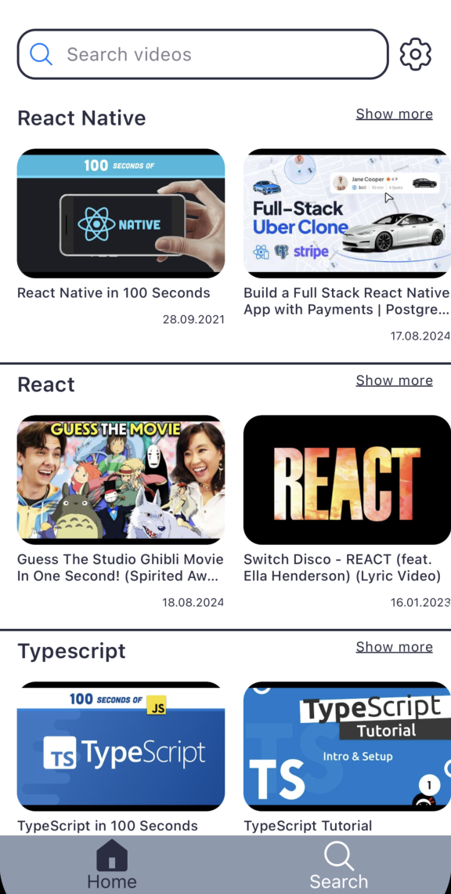
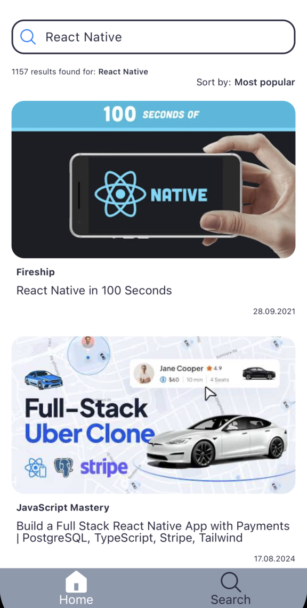
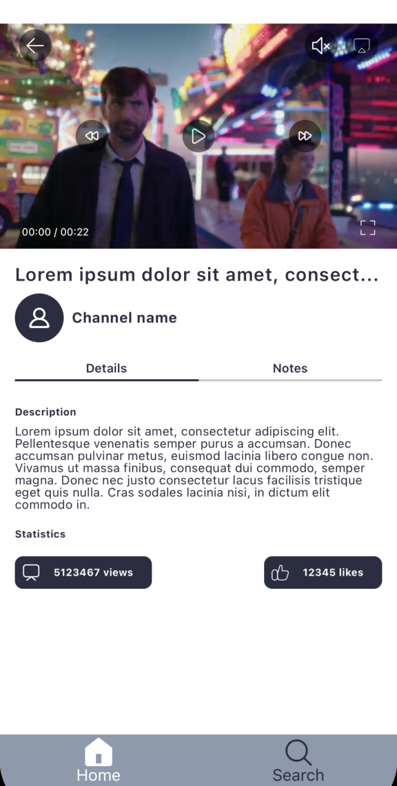
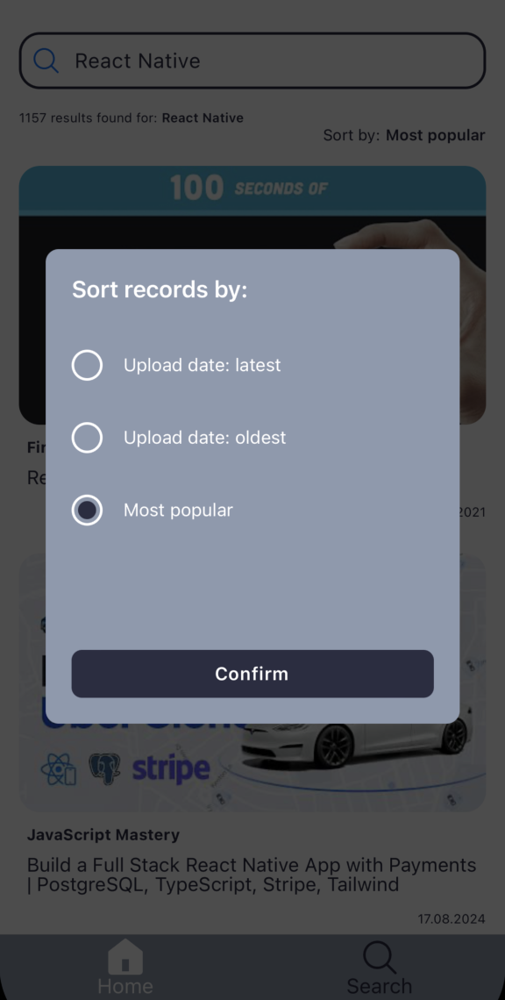

# VideoApp

# Welcome to your Expo app 👋

This is an [Expo](https://expo.dev) project created with [`create-expo-app`](https://www.npmjs.com/package/create-expo-app).

## Get started

1. Install dependencies

   ```bash
   npm install
   ```

2. Start the app

   ```bash
    npx expo start
   ```

# Video App

## Prerequisites

- [Node.js](https://nodejs.org/)

## Technologies Used

- React Native
- Expo
- TypeScript

## Installation

1. **Clone the repository**

   ```bash
   git clone https://github.com/irinosochka/VideoApp.git

2. **Navigate to the project directory**

   ```bash
   cd VideoApp

3. **Install dependencies**

   ```bash
   npm install
   ```

4. **Start the app**

   ```bash
    npx expo start
   ```

#### Login Screen


#### Main Screen


#### Search Screen


#### Video Details


#### Settings Screen


#### Sort by Modal

